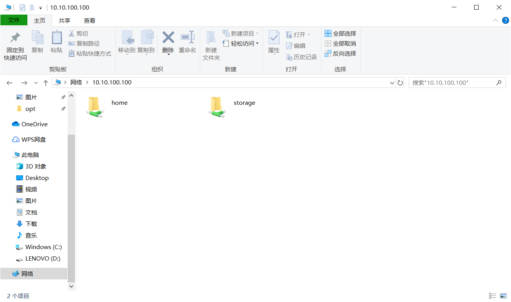
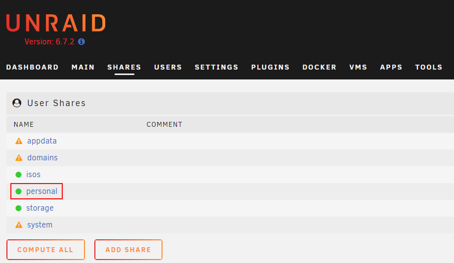
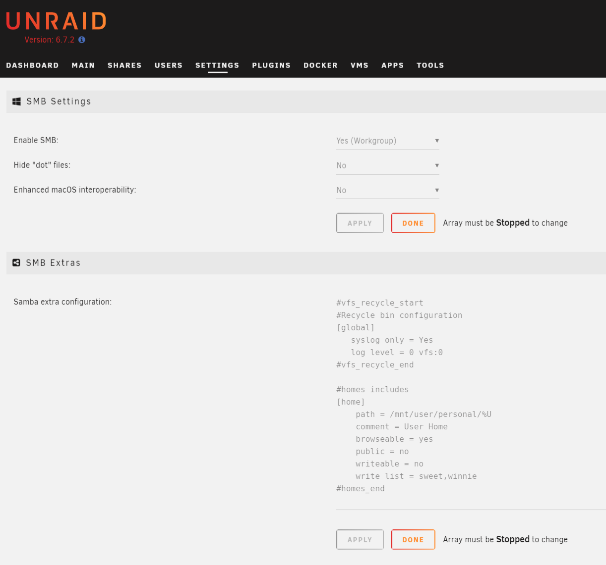
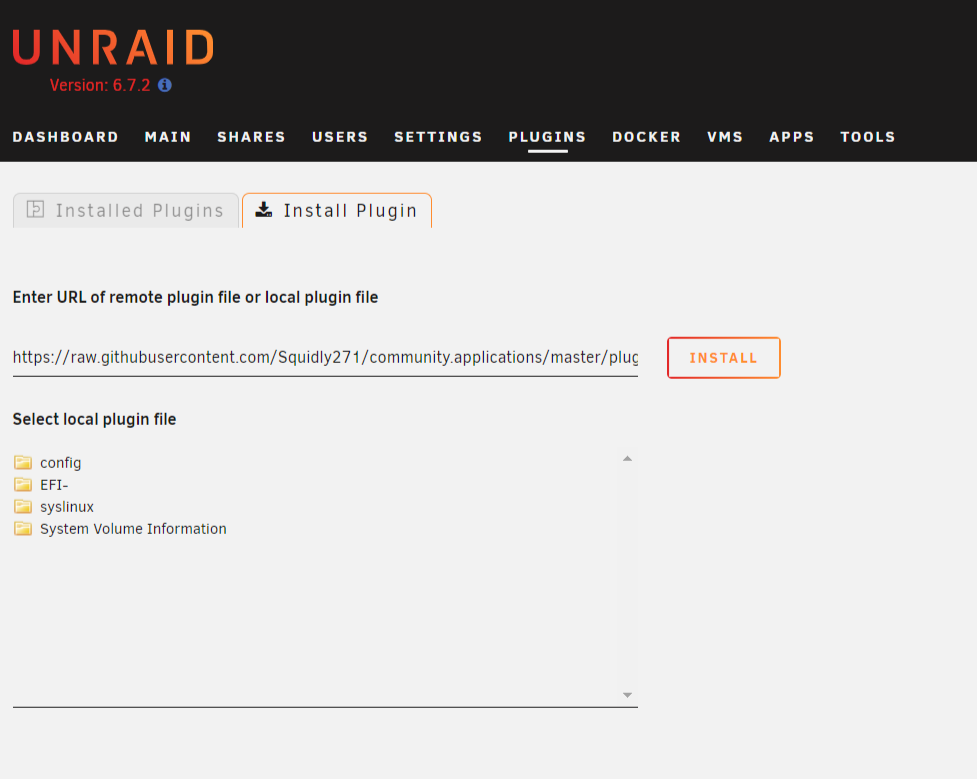
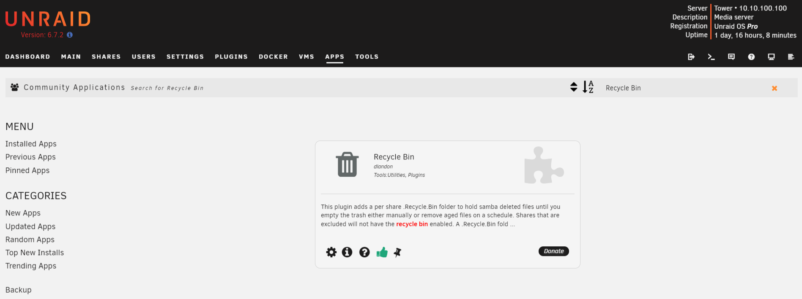
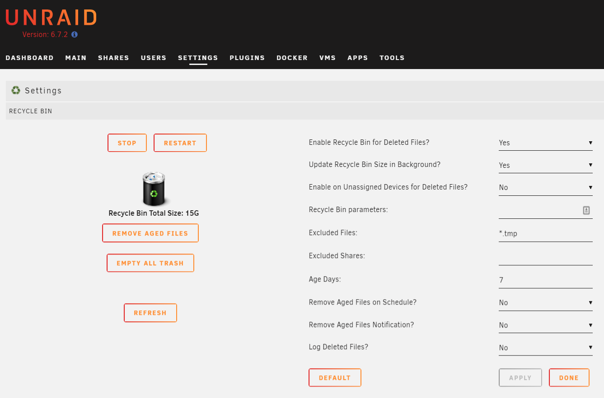
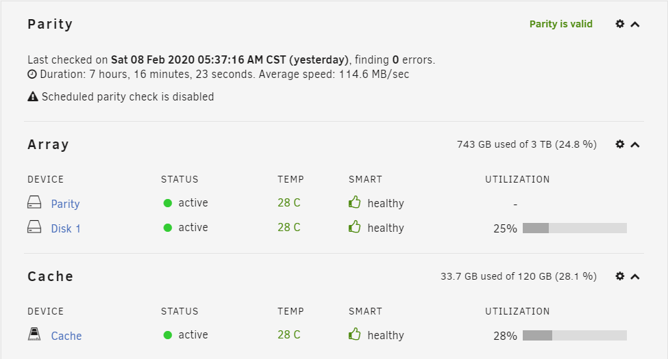
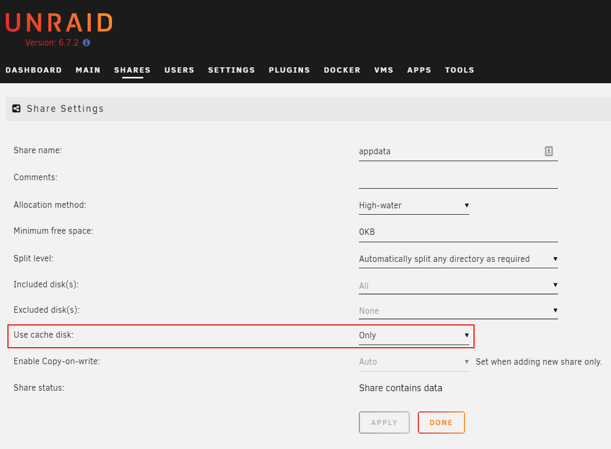

### SMB添加用户目录共享



NAS的共享文件夹，每个用户看到的都是不同的文件，相信大家一定见过群晖的homes共享吧。
如此，使用NAS就像windows桌面上的“我的文档”一样，每个用户只能看到自己的文件，既安全又方便，今天我就来帮大家实现上述效果。

首先，建立一个“personal”的共享文件夹，所有用户的文件都将存储在这个目录下。



第二步，修改SMB共享配置（Settings -- SMB -- SMB Extras）。

```
#homes includes
[home]
    path = /mnt/user/personal/%U
    comment = User Home
    browseable = yes
    public = no
    writeable = no
    write list = sweet,winnie
#homes_end
```




第三步，启动阵列，搞定收工。


### SMB添加回收站功能

首先安装插件 `社区应用市场`
> 社区应用市场 (https://raw.githubusercontent.com/Squidly271/community.applications/master/plugins/community.applications.plg)



第二步，安装插件 `Recycle Bin`



第三步，启用插件（Settings -- User Utilities -- Recycle Bin）



### 将VM虚拟机和Docker迁移至SSD固态硬盘
UnRAID默认将VM和Docker存储在阵列中，这样做可以保证数据的安全性，即使重装系统也不会丢失。
但机械硬盘的性能是远不及固态硬盘的，频繁的读写日志也会造成机械硬盘无法休眠，下面将VM及Docker迁移至SSD固态硬盘。

首先确保你的固态硬盘已经选为 `Cache设备` 。



​现在只需要打开 `appdata` 共享文件夹的配置，将 `Use cache disk:` 项，修改为 `Only` 即可。



