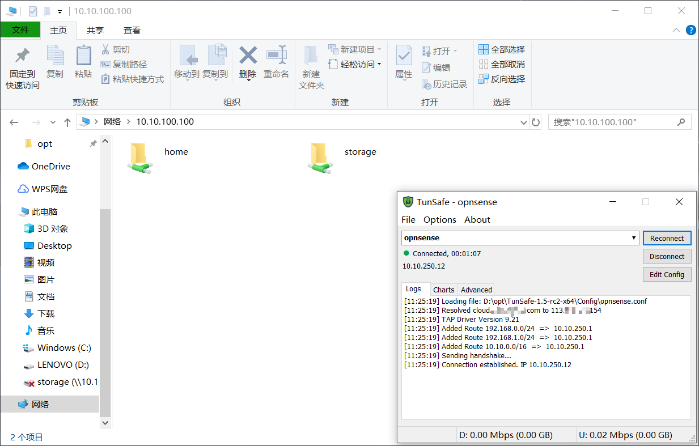

# 隧道技术，随时随地接入家庭内网

## 写在前面

搭建NAS的朋友想必都做过外网映射，把内部的服务一个一个的映射到外网，从而可以随时访问自己的相册、文件等等。

不过这篇文章，我要反其道行之，通过VPN隧道技术，将自己反向接入内网，如此，只需要映射一个端口，就可以通过这个端口随时置身于家庭内网之中，无限制地访问内网各个服务。

**（注意：本文需要拥有公网IP，没有的朋友请致电ISP提供商申请）**

## 隧道技术简介

隧道技术，是通过互联网，建立一条虚拟链路，以传递数据的方式。

举个例子，小王和小刘说着不同语言的不同方言，单独来看，两个人虽然都能说话，但却没办法明白对方想表达的意思，如果这时候小王唱起一首童年的旋律，小刘也就秒懂了对方的情谊。这里，歌曲就是依托于声音建立起的“隧道”。

理解了原理，下面要做的就简单多了。

建立一条“隧道”，这条隧道基于互联网，可以使我们获取家庭内部IP地址，随时访问内部服务。

实现的工具也有许多，OpenVPN、ZeroTier 等等，**WireGuard** 则是其中的佼佼者。

WireGuard 分为“服务端”与“客户端”，服务端部署在NAS，客户端可以是手机、平板或者公司的办公主机。

使用时，客户端通过“拨号”，接入服务端网络，而后就可以访问内部的服务了。

## 安装 WireGuard 服务端

作者使用的是unRAID平台，本篇文章就以此平台来进行说明，其他平台可以触类旁通，配置方法都是大同小异。

安装过程非常简单，“Community Applications” 中搜索 “WireGuard” 并进行安装。

**（注意：unRAID至少需要6.8.1，否则无法安装WireGuard，低版本的请自行百度升级）** 

**（注意：Community Applications 第三方库，安装教程请参看之前文章）**

## 配置 WireGuard（创建用户）

安装完成后，首先要进行配置，点击："Settings" -- "VPN Manager" 进入管理。

第一步，填写WireGuard名字。

第二步，点击右侧按钮生成服务端秘钥。

第三步，保持 "EndPoint" 使用默认的 51820 端口。

第四步，将服务设置为开机自动启动，并立即启用服务。

服务端配置好，开始给用户分配账号。

第一步，点击下方 "Add Peer"，设置Peer名字，

第二步，将 "Peer type of access" 设置为 "access to LAN"，这样才可以访问内网服务。

第三步，点击右侧生成客户端密钥对，并保存配置。

经过以上几个步骤，服务端就已经设置好了，记得开启路由器的 51820 端口映射（由于不同路由配置方式不同，不详细说明），这样外网才可以连接到 WireGuard 服务。

## 安装 WireGuard 客户端

WireGuard 客户端支持 Windows、Linux、Android、iOS，首先介绍 Win10 下的使用方法。

第一步，下载 TunSafe (https://tunsafe.com/)。

下载后看到有一个“Config”文件夹，进入后复制一份配置文件，并使用“记事本”打开编辑。

第二步，配置秘钥和连接地址。

这里特别说明一下，

Endpoint 表示需要连接的服务器地址，也就是NAS的公网IP地址（下文会使用域名代替IP）。

AllowedIPs 表示需要将哪些地址转发到VPN，不确定的朋友直接用（**192.168.0.0/16, 10.0.0.0/8**）。

PersistentKeepalive 需要与服务器保持一致，服务器配置多少，客户端就配置多少。

第三步，开启连接。

手机端的配置方式与 Win平台大体相同，这里就不做详细介绍了。

## 注册免费域名

正常办理的宽带并没有公网IP，需要打电话到电信申请，申请理由根据个人的实际情况向电信说明，如安装监控等。。。

申请到公网IP地址后，IP会隔段时间自动变化，想依靠变化的IP访问NAS不太现实，这时就需要一个简单好记的域名来映射IP地址了。

[Duck DNS](https://www.duckdns.org/) 是一项免费DNS解析服务，使用 Duck DNS 可以为我们省下购买域名的费用（虽然域名也不贵）。（https://www.duckdns.org/）

准备工作：

1. 使用 Github 或者其他的账号登录
2. 申请一个自己的子域名
3. 记录下自己的token令牌

而后回到 unRAID ，在“应用市场”中安装这只小黄鸭（Duckdns），并配置好刚刚申请的子域名和令牌。

启动起来后，就可以通过域名访问自己的IP地址了。（xxxxx.duckdns.org）

## 总结
